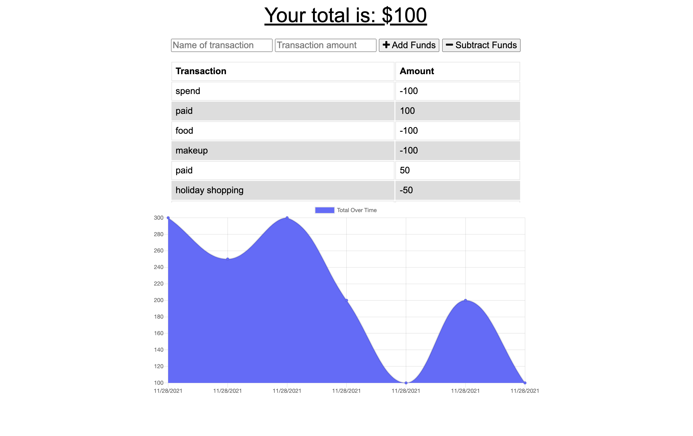

# Budget Tracker Starter Code

## Description

- This application's purpose is to provide a PWA (progressive web application) that serves as a budget tracking application for users who may be avid travelers and want to track withdrawals and deposits with or without internet connection.

## Installation

Simply click the link and enjoy the application. Users can also press the "+" button on the top right of the url to download the progressive web application to their home screens.

## Usage

This application is intended for a user to manage their budget and track expenses in the form of a PWA, and having access to document these transactions with or without internet.

## Built with:

- Node.js
- Express.js
- JavaScript
- HTML
- CSS

## This application can be found:

- [Deployed Application](http://budget-tracker-proj.herokuapp.com/)
- [Repository](https://github.com/michellewehr/Budget-Tracker)

## Contribution

Anyone is welcome to contribute to this project. To do so, clone the local repository to your local workspace, create a git feature branch and request a pull request. Upon review, the pull request will then be accepted or denied.

## Sources

- This project was inspired by UCONN's School of Engineering Coding Bootcamp.
- Starter code was provided. The link to that repository can be found here:
  [Starter_Repository](https://github.com/coding-boot-camp/symmetrical-bassoon)

## Author

Michelle Wehr
